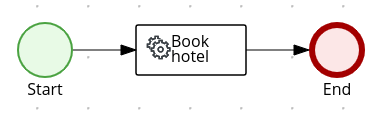
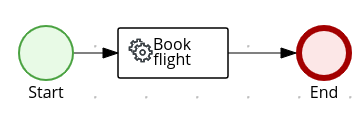
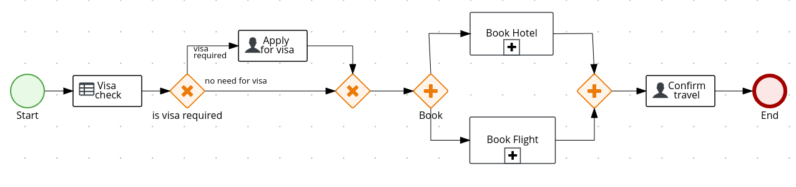

# INSTRUCTIONS FOR THE KOGITO WORKSHOP DEVCONF.CZ 2020

Table of Contents
=================

* [1) Pre requisites](#1-pre-requisites)
* [2) Generate the project skeleton](#2-generate-the-project-skeleton)
* [3) Verify if everything is fine](#3-verify-if-everything-is-fine)
* [4) Install the Kogito Extension in VSCode](#4-install-the-kogito-extension-in-vscode)
* [5) Import the generated project into VSCode](#5-import-the-generated-project-into-vscode)
* [6) Import the required resources to the project](#6-import-the-required-resources-to-the-project)
* [7) Run the test rules](#7-run-the-test-rules)
* [8) Create service classes](#8-create-service-classes)
* [9) Create the business logic for the Hotel Booking](#9-create-the-business-logic-for-the-hotel-booking)
* [10) Create the business logic for the Flight Booking](#10-create-the-business-logic-for-the-flight-booking)
* [11) Create the business logic for the Travel Request](#11-create-the-business-logic-for-the-travel-request)
* [12) Verify the REST Endpoints](#12-verify-the-rest-endpoints)
* [13) Verify the User Interface](#13-verify-the-user-interface)
* [Solution](#solution)
* [Resources](#resources)

Created by [gh-md-toc](https://github.com/ekalinin/github-markdown-toc)

## 1) Pre requisites

Make sure that you have everything set and installed before continue:

- [OpenJDK 8+](https://computingforgeeks.com/how-to-install-java-11-openjdk-11-on-rhel-8)
- [VSCode 1.41.1](https://code.visualstudio.com/docs/setup/linux)
- [Kogito VSCode extension (latest)](https://github.com/kiegroup/kogito-tooling/releases)
- [Red Hat Java VSCode extension (latest)](https://marketplace.visualstudio.com/items?itemName=redhat.java)
- [Maven 3.6.0+](https://maven.apache.org/install.html)
- [Git](https://git-scm.com/book/en/v2/Getting-Started-Installing-Git)

## 2) Generate the project skeleton

```bash
mvn io.quarkus:quarkus-maven-plugin:1.1.1.Final:create \
    -DprojectGroupId=org.acme.travel \
    -DprojectArtifactId=kogito-travel-agency \
    -Dextensions="kogito,openapi"
```

This command will generate the following project structure:

```bash
ll kogito-travel-agency/
total 28
-rwxrwxr-x. 1 ricferna ricferna 10078 Jan 24 10:47 mvnw
-rw-rw-r--. 1 ricferna ricferna  6609 Jan 24 10:47 mvnw.cmd
-rw-rw-r--. 1 ricferna ricferna  3967 Jan 24 10:47 pom.xml
-rw-rw-r--. 1 ricferna ricferna  1188 Jan 24 10:47 README.md
drwxrwxr-x. 4 ricferna ricferna    80 Jan 24 10:47 src
```

## 3) Verify if everything is fine

Run the following commands and wait a little bit to verify if the project was generated correctly:

```bash
cd kogito-travel-agency
```

```bash
mvn compile quarkus:dev
```

Open your favorite web browser and go to http://localhost:8080. A default welcome Quarkus page should open.

## 4) Install the Kogito Extension in VSCode

1. Download the latest Visual Studio plugin from the project page: https://github.com/kiegroup/kogito-tooling/releases
2. Select the latest version
3. From asset section download the file `vscode_extension_kogito_kie_editors_0.2.7.vsix` (the version might change)
4. Open Visual Studio Code
    1. Select the Extensions pane on the left
    2. Click the`...` icon on the top right
    3. Select **Install from VSIX...**

## 5) Import the generated project into VSCode

1. Open Visual Studio Code
2. Go to "File", "Add Folder to Workspace"
3. Select the Folder `kogito-travel-agency` in your file system
4. Click "Add"

Alternatively, you could run the following command on your terminal:

```bash
code kogito-travel-agency
```

`kogito-travel-agency` is the project folder.

## 6) Import the required resources to the project

In this step you will import the required data objects (`Address.java`, `Flight.java`, `Hotel.java`, `Traveller.java`, `Trip.java`) . A decision table will also be added to your project under `resources/org/acme/travel/visa-rules.xls`. Finally, two tests are going to be imported `TravelTest.java` and `VisaRulesTest.java`. 

1. Clone the DevConf 2020 Workshop:

```bash
# make sure to exit from the kogito-travel-agency directory
cd … 
git clone https://github.com/cristianonicolai/devconfcz-2020 
```

2. Move the domain data and test files to your project:

```bash
cp -r devconfcz-2020/src/* kogito-travel-agency/src/
```

3. Make sure that everything is compiling:

```bash
cd kogito-travel-agency
mvn clean compile
```

## 7) Run the test rules

1. Add the following dependency in the `pom.xml` file in the project root just after the tag `<dependencies>`

```xml
<dependency>
      <groupId>org.kie.kogito</groupId>
      <artifactId>drools-decisiontables</artifactId>
</dependency>
```

2. Run the tests

```bash
mvn clean verify
```

All tests should pass.

## 8) Create service classes

Add the following two clases which will be a flight and hotel services, inside the `src/main/java/org/acme/travel/service` folder: 

1. Create `FlightBookingService`, a CDI bean with an `ApplicationScoped` annotation, that contains one method, receiving a `Trip` object and returning a `Flight` one.

2. Create `HotelBookingService`, a CDI bean with an `ApplicationScoped` annotation, that contains one method, receiving a `Trip` object and returning a `Hotel` one.

3. Verify your work

```bash
mvn clean verify
```

## 9) Create the business logic for the Hotel Booking



1. On `src/main/resources/org/acme/travel`, create new BPMN file named `hotelBooking.bpmn2` for the Hotel booking sub-process. Since you have installed an extension, VSCode will automatically open a BPMN editor for you. Using the BPMN editor, set the following process attributes (properties panel on right side):

- Process Name: _Hotel Booking_
- Id: _hotelBooking_
- Package: `org.acme.travel`
- Process data:
    Add two process variables:
    - Name: _hotel_ Data type (custom): `org.acme.travel.Hotel`
    - Name: _trip_ Data type (custom): `org.acme.travel.Trip`

**Important!** Save your work: ctrl+s (Or cmd+s if you are using mac)

2. Model Hotel Booking process

 - Add a start node, a service task for executing the `HotelBookingService` bean and an end node.
 - Select the new service task node:
   -  Configure it's name, you can set it with the name `Book Hotel`;
   -  Modify the following properties (Implementation/Execution):
     - Select Implementation _Java_
     - Interface, the complete name (FQDN) of the `HotelBookingService` class: `org.acme.travel.service.HotelBookingService`
     - Operation, the name of the method that you created in the `HotelBookingService` class service.
     - Assignments:
          - Input: Add an input named _Parameter_ of type (custom) `org.acme.travel.Trip` and source _trip_.
          - Output: Add an output named _Result_ of type (custom) `org.acme.travel.Hotel` and source _hotel_.

**Important!** Save your work: ctrl+S (or cmd+s)

## 10) Create the business logic for the Flight Booking



1. On `src/main/resources/org/acme/travel`, create new BPMN file named `flightBooking.bpmn2` for the Flight booking sub-process. Using the BPMN editor, set the following process attributes (properties panel on right side):

- Process Name: _Flight Booking_
- Id: _flightBooking_
- Package: `org.acme.travel`
- Process data:
    Add two process variables:
    - Name: _flight_ Data type (custom): `org.acme.travel.Flight`
    - Name: _trip_ Data type (custom): `org.acme.travel.Trip`

**Important!** Save your work: ctrl+S

2. Model Flight Booking process

 - Add a start node, a service task for executing the `FlightBookingService` bean and an end node.
 - Select the new service task node and:
   - Name it as _Book flight_ 
   - Modify the following properties (Implementation/Execution):
     - Select Implementation _Java_
     - Interface, the fully complete name of the `FlightBookingService` class: `org.acme.travel.service.FlightBookingService`
     - Operation, the name of the method that you created in the `FlightBookingService` class service.
     - Assignments:
          - Input: Add an input named _Parameter_ of type `org.acme.travel.Trip` and source _trip_.
          - Output: Add an output named _Result_ of type `org.acme.travel.Flight` and source _flight_.

**Important!** Save your work: ctrl+S (or cmd+s)

## 11) Create the business logic for the Travel Request



1. On `src/main/resources/org/acme/travel`, create new BPMN file for the Travels process. Using the BPMN editor, set the following process attributes (properties panel on right side):

- Process Name: _Travels_
- Id: _travels_
- Package: `org.acme.travel`
- Process data (add the following process variables):
    - Name: _flight_ Data type (custom): `org.acme.travel.Flight`
    - Name: _trip_ Data type (custom): `org.acme.travel.Trip`
    - Name: _hotel_ Data type (custom): `org.acme.travel.Hotel`
    - Name: _traveller_ Data type (custom): `org.acme.travel.Traveller`

**Important!** Save your work: ctrl+S

2. Model Travel process

- Add start node
- From start node, add _Visa Check_ rule node with the following attributes:
    - Name: _Visa Check_
    - Implementation/Execution
        - Rule Language: _DRL_
        - Rule Flow Group (new): _visas_
    - Data Assignments
      - Input:
        - Add an input named _trip_ of type (custom) `org.acme.travel.Trip` and source _trip_.
        - Add an input named _traveller_ of type (custom) `org.acme.travel.Traveller` and source _traveller_.
      - Output:
        - Add an output named _trip_ of type `org.acme.travel.Trip` and target _trip_.

**Important!** Save your work: ctrl+S

- From _Visa Check_, add an exclusive gateway
- From the exclusive gateway, add a user task named _Visa Application_ with the following attributes
    - Implementation/Execution, Task Name: _VisaApplication_
- Select the connecting arrow between the exclusive gateway and the _Visa Application_ task and set the following attribute:
    - Implementation/Execution,  Expression radio button:
    ```java
        return trip.isVisaRequired();
    ```
- Add new exclusive gateway and connect both nodes _Visa Application_ and previous exclusive gateway, creating a fork in the process model.
- Select the connecting arrow between both exclusive gateways and set the following attribute:
    - Implementation/Execution, Expression radio button:
    ```java
        return !trip.isVisaRequired();
    ```
- From the newly created exclusive gateway, add new parallel gateway.
- From the parallel gateway, add new reusable sub-process for _Book Hotel_ process with the following attributes:
  - Implementation/Execution, Called Element (new): _hotelBooking_
  - Data Assignments
    - Input: Add an input named _trip_ of type (custom) `org.acme.travel.Trip` and source _trip_.
    - Output: Add an output named _hotel_ of type `org.acme.travel.Hotel` and source _hotel_.

**Important!** Save your work: ctrl+S

- From the parallel gateway add new reusable sub-process for _Book Flight_ process with the following attributes:
  - Implementation/Execution, Called Element (new): _flightBooking_
  - Data Assignments
    - Input: Add an input named _trip_ of type (custom) `org.acme.travel.Trip` and source _trip_.
    - Output: Add an output named _flight_ of type (custom) `org.acme.travel.Flight` and source _flight_.
    - Click Save
 
**Important!** Save your work: ctrl+S

- Add new parallel gateway and connect both reusable sub-process nodes into it.
- From the parallel gateway, add new user task named _Confirm Travel_ with the following attributes:
    - Task Name: _ConfirmTravel_
- From the _Confirm Travel_, add an end node.

**Important!** Save your work: ctrl+S

To test your process, uncomment the tests ([CTRL+K, CTRL+U](https://stackoverflow.com/questions/5717816/how-to-uncomment-multiple-lines-of-code-in-visual-studio/5717871)) on `src/test/java/org/acme/travel/TravelTest.java` and execute:

```bash
mvn clean verify
```

Your test will fail because the assertions are expecting fixed values that are being returned from your services. Make sure to fix your services and try again.

## 12) Verify the REST Endpoints

1. Run the following command to execute your Kogito application:

```bash
mvn clean quarkus:dev
```

2. Verify travels endpoint:

```bash
curl -X GET http://localhost:8080/travels
```

Should return an empty array since you don’t have any travels yet.

3. Post new Travel that **does not** require visa

```bash
curl -H "Content-Type: application/json" -H "Accept: application/json" -X POST http://localhost:8080/travels -d @- << EOF
{
    "traveller" : {
        "firstName" : "John",
        "lastName" : "Doe",
        "email" : "john.doe@example.com",
        "nationality" : "American",
        "address" : {
            "street" : "main street",
            "city" : "Boston",
            "zipCode" : "10005",
            "country" : "US"
        }
    },
    "trip" : {
        "city" : "New York",
        "country" : "US",
        "begin" : "2019-12-10T00:00:00.000+02:00",
        "end" : "2019-12-15T00:00:00.000+02:00"
    }
}
EOF
```

Make note of the returned `id` field, since your will need it from now on.

4. Get open tasks for current process, should return `ConfirmTravel` (replace `{uuid}` with the `id` field returned in the previous step):

```bash
curl -X GET http://localhost:8080/travels/{uuid}/tasks
```

Make note of the returned `id` field, since your will need it from now on in the `task-uuid` placeholders.

5. Completes confirms travel task - meaning confirms (and completes) the travel request:

Replace `{uuid}` with the `id` returned from the step #3 and `{task-uuid}` with the id from the previous step (#4):

```bash
curl -H "Content-Type: application/json" -H "Accept: application/json" -X POST http://localhost:8080/travels/{uuid}/ConfirmTravel/{task-uuid} -d '{}'
```

You should receive a reply similar to this one:

```json
{"id":"966aa8a3-0e3f-4263-8e0e-780170e846e5","flight":{"flightNumber":"MX555","seat":"34B","gate":"C4","departure":1575928800000,"arrival":1575928800000},"trip":{"city":"New York","country":"US","begin":1575928800000,"end":1576360800000,"visaRequired":false},"hotel":{"name":"Perfect hotel","address":{"street":"34 Great Streat","city":"New York","zipCode":"05644","country":"US"},"phone":"09876543","bookingNumber":"XX-012345","room":"69"},"traveller":{"firstName":"John","lastName":"Doe","email":"john.doe@example.com","nationality":"American","address":{"street":"main street","city":"Boston","zipCode":"10005","country":"US"}}}
```

6. Verify process has finished (replace `{uuid}` with the same `id` from the travels endpoint)

```sh
curl -X GET http://localhost:8080/travels/{uuid}
```

You’ll receive an empty response, the process has finished and there’s no reason to keep the travel anymore.

7. Post new Travel that **does** require visa

```sh
curl -H "Content-Type: application/json" -H "Accept: application/json" -X POST http://localhost:8080/travels -d @- << EOF
{
    "traveller" : {
        "firstName" : "Jan",
        "lastName" : "Kowalski",
        "email" : "jan.kowalski@example.com",
        "nationality" : "Polish",
        "address" : {
            "street" : "polna",
            "city" : "Krakow",
            "zipCode" : "32000",
            "country" : "Poland"
        }
    },
    "trip" : {
        "city" : "New York",
        "country" : "US",
        "begin" : "2019-12-10T00:00:00.000+02:00",
        "end" : "2019-12-15T00:00:00.000+02:00"
    }
}
EOF
```

Make note of the returned `id` field, since your will need it from now on.

8. Get open tasks for current process, should return `VisaApplication` (replace `{uuid}` with the `id` field returned in the previous step):

```sh
curl -X GET http://localhost:8080/travels/{uuid}/tasks
```

Make note of the returned `id` field, since your will need it from now on in the `task-uuid` placeholders.

9. Completes Visa Application request. Replace `{uuid}` with the `id` returned from the step #7 and `{task-uuid}` with the id from the previous step (#8):

```sh
curl -H "Content-Type: application/json" -H "Accept: application/json" -X POST http://localhost:8080/travels/{uuid}/VisaApplication/{task-uuid} -d '{}'
```

10. Get open tasks for current process, should return `ConfirmTravel`. Replace `{uuid}` with the travel `id`:

```sh
curl -X GET http://localhost:8080/travels/{uuid}/tasks
```

11. Completes confirms travel task - meaning confirms (and completes) the travel request. Replace the ids placeholders accordingly:

```sh
curl -H "Content-Type: application/json" -H "Accept: application/json" -X POST http://localhost:8080/travels/{uuid}/ConfirmTravel/{task-uuid} -d '{}'
```

12. Verify process has finished:

```sh
curl -X GET http://localhost:8080/travels/{uuid}
```

You’ll receive an empty response, the process has finished and there’s no reason to keep the travel anymore.

## 13) Verify the User Interface

Explore Swagger UI on http://localhost:8080/swagger-ui/

Plan new travel requests using the Travel Agency UI available on http://localhost:8080/

## Solution

Just clone the branch `solved`:

```bash
git clone -b solved --single-branch git@github.com:cristianonicolai/devconfcz-2020.git devconfcz-2020-solved
```

Run the application:

```bash
cd devconfcz-2020-solved
mvn clean verify quarkus:dev
```

## Resources

- [Kogito Wiki](https://github.com/kiegroup/kogito-runtimes/wiki)
- [Kogito Workshop DevConf.CZ 2020 Presentation](https://docs.google.com/presentation/d/1qPpeUd3lsLNvQJHLNAqBEcmN1mirtHVQM1pU7SEgTF0/)
- [Workshop Feedback - we want to hear back from you](https://docs.google.com/forms/d/e/1FAIpQLSd0_VScAhwPgcM3qm1CDKUvPxcGrCT0bP-BWEMLSvbVaCRUGA/viewform?usp=sf_link)
